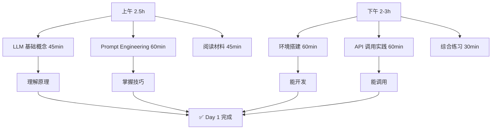
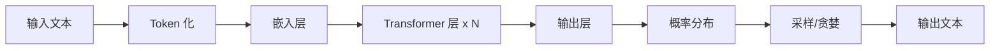
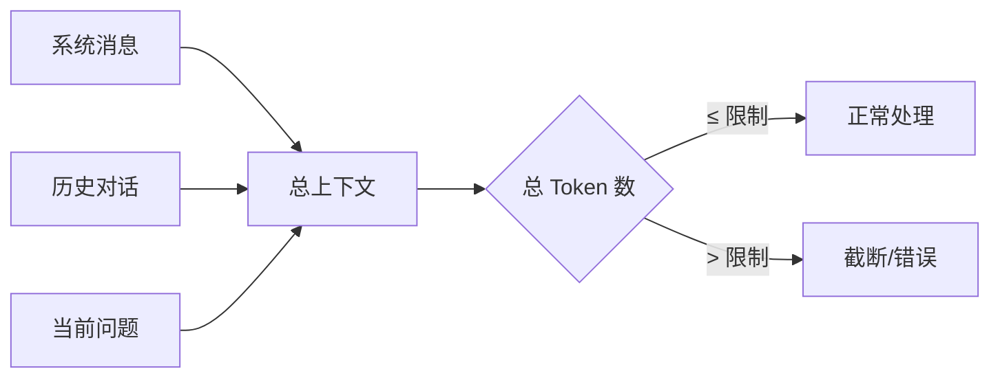
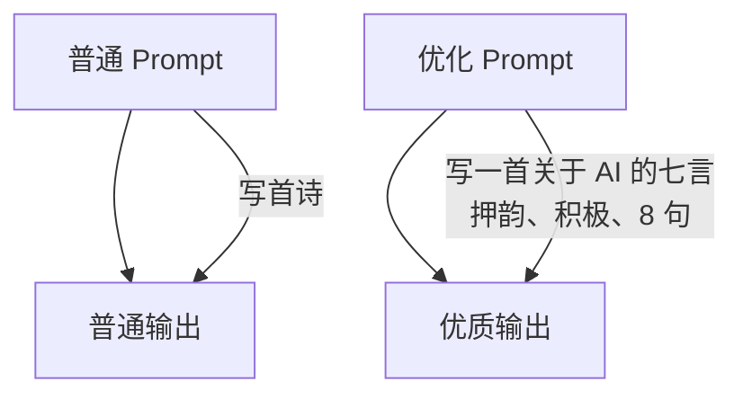

# Day 1 - LLM 基础与环境搭建

**日期**: 2026-03-30（周一）  
**预计时间**: 4-5 小时  
**难度**: ⭐⭐  
**状态**: 📚 深入学习版

---

## 📚 学习目标

完成今天的学习后，你将能够：

- ✅ 解释 LLM 的工作原理（不是死记硬背）
- ✅ 计算 Token 数量并理解成本
- ✅ 使用 5+ 种 Prompt 技巧
- ✅ 搭建完整的 Python 开发环境
- ✅ 独立调用 LLM API 完成实际任务

---

## 🗺️ 今日学习路线图



---

## 📖 上午：理论基础（2.5 小时）

### 1. LLM 基础概念（45 分钟）

#### 1.1 什么是 LLM？

**LLM = Large Language Model（大语言模型）**

简单理解：一个经过海量文本训练的"文字接龙"系统

```
输入："今天天气真"
模型预测：["好", "不错", "晴朗", ...]
输出："今天天气真好"
```

#### 1.2 LLM 工作原理图解



**核心流程**：
1. **Token 化**: 文字 → 数字 ID
2. **嵌入**: 数字 → 向量
3. **Transformer**: 上下文理解
4. **输出**: 向量 → 概率 → 文字

#### 1.3 Token 详解

**Token 是什么？**

- 英文：约 4 字符 = 1 Token
- 中文：约 1.5 汉字 = 1 Token
- 示例：
  ```
  "Hello world" → 2 Tokens
  "你好世界" → 3-4 Tokens
  ```

**Token 计算器**：

| 内容类型 | 估算公式 |
|----------|----------|
| 英文文本 | 字符数 ÷ 4 |
| 中文文本 | 字数 × 1.5 |
| 代码 | 字符数 ÷ 3.5 |

**在线工具**: [Token 计数器](https://platform.openai.com/tokenizer)

#### 1.4 上下文窗口（Context Window）



**常见模型限制**：

| 模型 | 上下文窗口 | 适用场景 |
|------|------------|----------|
| GPT-3.5-Turbo | 16K | 日常对话 |
| GPT-4-Turbo | 128K | 长文档分析 |
| Claude-3 | 200K | 书籍级文本 |
| Qwen-2 | 128K | 中文长文本 |

#### 1.5 关键参数详解

```python
# 参数可视化理解
parameters = {
    "temperature": "控制随机性 (0=确定，1=随机)",
    "top_p": "核采样 (0.9=从前 90% 概率选)",
    "max_tokens": "最大输出长度",
    "frequency_penalty": "减少重复 (-2~2)",
    "presence_penalty": "鼓励新话题 (-2~2)"
}
```

**参数效果对比**：

| Temperature | 输出特点 | 适用场景 |
|-------------|----------|----------|
| 0.0 | 确定、保守 | 代码、事实问答 |
| 0.3-0.5 | 平衡 | 一般对话 |
| 0.7-0.9 | 创意、多样 | 写作、头脑风暴 |
| 1.0+ | 高度随机 | 诗歌、创意 |

---

### 2. Prompt Engineering 基础（60 分钟）

#### 2.1 什么是 Prompt Engineering？

**定义**: 设计有效的输入提示，让 LLM 输出更好的结果



#### 2.2 核心技巧（必须掌握）

##### 技巧 1: Zero-Shot Prompting

**不使用示例，直接提问**

```
❌ 差："翻译这句话"
✅ 好："将以下英文翻译成中文，保持专业语气：[文本]"
```

##### 技巧 2: Few-Shot Prompting

**提供示例，让模型学习模式**

```
示例：
输入："高兴" → 输出："happy"
输入："悲伤" → 输出："sad"
输入："兴奋" → 输出："___"

模型会填："excited"
```

##### 技巧 3: Chain of Thought (CoT)

**让模型展示思考过程**

```
❌ 直接问："小明有 5 个苹果，吃了 2 个，又买了 3 个，现在有几个？"
✅ CoT："小明有 5 个苹果，吃了 2 个，又买了 3 个，现在有几个？请逐步思考。"

输出：
1. 初始：5 个
2. 吃了 2 个：5-2=3 个
3. 买了 3 个：3+3=6 个
4. 答案：6 个
```

##### 技巧 4: Role Prompting

**给模型设定角色**

```
"你是一位资深 Python 工程师，擅长编写清晰、高效的代码。
请帮我 review 以下代码，指出问题并给出改进建议..."
```

##### 技巧 5: System Message

**使用系统消息设定行为**

```python
messages = [
    {"role": "system", "content": "你是一个简洁的助手，只用一句话回答。"},
    {"role": "user", "content": "今天天气如何？"}
]
# 输出："抱歉，我无法获取实时天气信息。"
```

#### 2.3 Prompt 模板

**通用模板**：

```markdown
# Role
你是一位 [角色]，擅长 [技能]

# Task
请完成以下任务：[任务描述]

# Constraints
- 限制 1
- 限制 2
- 输出格式：[格式要求]

# Examples
输入：[示例输入]
输出：[示例输出]

# Input
[实际输入]
```

---

### 3. 阅读材料（45 分钟）

#### 必读（30 分钟）

1. **[OpenAI Prompt Engineering Guide](https://platform.openai.com/docs/guides/prompt-engineering)** (15min)
   - 官方最佳实践
   - 重点看：Tactics 部分

2. **[LLM University - Cohere](https://docs.cohere.com/docs/llmu)** (15min)
   - 免费课程
   - 完成：Prompt Engineering 模块

#### 选读（15 分钟）

3. **[Prompt Engineering Guide](https://www.promptingguide.ai/)** 
   - 社区维护的全面指南
   - 查阅：Introduction 部分

---

## 💻 下午：实践操作（2-3 小时）

### 4. 环境搭建（60 分钟）

#### 4.1 安装 Python

```bash
# 检查 Python 版本（需要 3.8+）
python3 --version

# 如果没有，安装：
# macOS
brew install python@3.11

# Ubuntu/Debian
sudo apt update && sudo apt install python3.11 python3.11-venv

# 验证
python3 --version  # 应显示 3.8+
```

#### 4.2 创建项目环境

```bash
# 1. 创建项目目录
mkdir -p ~/ai-agent-learning/day-01
cd ~/ai-agent-learning/day-01

# 2. 创建虚拟环境
python3 -m venv .venv

# 3. 激活虚拟环境
source .venv/bin/activate  # macOS/Linux
# .venv\Scripts\activate   # Windows

# 4. 验证激活
which python  # 应指向 .venv 内的 python
```

#### 4.3 安装依赖

```bash
# 创建 requirements.txt
cat > requirements.txt << EOF
openai>=1.0.0
anthropic>=0.18.0
requests>=2.31.0
python-dotenv>=1.0.0
EOF

# 安装
pip install -r requirements.txt

# 验证安装
python -c "import openai; print(openai.__version__)"
```

#### 4.4 配置环境变量

```bash
# 创建 .env 文件
cat > .env << EOF
# OpenAI API Key
OPENAI_API_KEY=sk-your-key-here

# 或者使用国内替代
# ZHIPU_API_KEY=your-zhipu-key
# QWEN_API_KEY=your-qwen-key
EOF

# ⚠️ 重要：将.env 加入.gitignore
echo ".env" >> .gitignore
```

---

### 5. 第一个 API 调用（60 分钟）

#### 5.1 基础对话脚本

创建文件 `basic_chat.py`:

```python
#!/usr/bin/env python3
"""
Day 1: 第一个 LLM 对话
学习目标：理解 API 调用基本流程
"""

from openai import OpenAI
from dotenv import load_dotenv
import os

# 加载环境变量
load_dotenv()

# 初始化客户端
client = OpenAI(api_key=os.getenv("OPENAI_API_KEY"))

def simple_chat():
    """简单对话"""
    response = client.chat.completions.create(
        model="gpt-3.5-turbo",
        messages=[
            {"role": "system", "content": "你是一个友好的助手。"},
            {"role": "user", "content": "你好，请介绍一下你自己。"}
        ],
        temperature=0.7,
        max_tokens=200
    )
    
    print("助手:", response.choices[0].message.content)
    print(f"\n使用 Token: {response.usage.total_tokens}")

if __name__ == "__main__":
    simple_chat()
```

#### 5.2 运行测试

```bash
# 运行脚本
python basic_chat.py

# 预期输出：
# 助手：你好！我是一个 AI 助手...
# 使用 Token: 45
```

#### 5.3 参数实验

创建文件 `experiment_params.py`:

```python
#!/usr/bin/env python3
"""
参数对比实验
观察不同参数对输出的影响
"""

from openai import OpenAI
import os

client = OpenAI(api_key=os.getenv("OPENAI_API_KEY"))

def test_temperature():
    """测试不同 temperature 值"""
    prompt = "写一句关于 AI 的话"
    
    temps = [0.0, 0.5, 0.7, 1.0]
    
    for temp in temps:
        response = client.chat.completions.create(
            model="gpt-3.5-turbo",
            messages=[{"role": "user", "content": prompt}],
            temperature=temp
        )
        
        print(f"\nTemperature={temp}:")
        print(response.choices[0].message.content)

def test_system_message():
    """测试系统消息的影响"""
    prompt = "今天天气怎么样？"
    
    systems = [
        "你是一个友好的助手。",
        "你是一个简洁的助手，只用一句话回答。",
        "你是一个幽默的助手，喜欢开玩笑。"
    ]
    
    for system in systems:
        response = client.chat.completions.create(
            model="gpt-3.5-turbo",
            messages=[
                {"role": "system", "content": system},
                {"role": "user", "content": prompt}
            ]
        )
        
        print(f"\nSystem: {system}")
        print("回答:", response.choices[0].message.content)

if __name__ == "__main__":
    print("=== Temperature 实验 ===")
    test_temperature()
    
    print("\n=== System Message 实验 ===")
    test_system_message()
```

---

### 6. 综合练习（30 分钟）

#### 练习 1: 个人介绍机器人

**要求**：
- 使用 System Message 设定角色
- 能回答关于你的基本信息
- 测试不同 Temperature 的效果

```python
# 创建文件：practice_1.py
from openai import OpenAI
import os

client = OpenAI(api_key=os.getenv("OPENAI_API_KEY"))

def create_personal_assistant():
    messages = [
        {"role": "system", "content": "你是 GBoss 的个人助手，了解以下信息：\n- 姓名：GBoss\n- 职业：安卓开发工程师\n- 目标：转行 AI Agent 开发\n- 地点：上海"},
        {"role": "user", "content": "GBoss 是做什么的？"}
    ]
    
    response = client.chat.completions.create(
        model="gpt-3.5-turbo",
        messages=messages,
        temperature=0.5
    )
    
    print(response.choices[0].message.content)

if __name__ == "__main__":
    create_personal_assistant()
```

#### 练习 2: Prompt 技巧实践

**任务**：用 5 种不同方式问同一个问题，对比输出质量

```
问题：解释什么是 AI Agent

方式 1: Zero-shot
方式 2: Few-shot（给示例）
方式 3: Chain of Thought
方式 4: Role Prompting
方式 5: System Message

记录每种方式的输出差异
```

---

## ✅ 完成检查清单

### 理论部分
- [x] 理解 LLM 基本原理（能向别人解释）
- [x] 会计算 Token 数量
- [x] 理解上下文窗口限制
- [x] 掌握 5 个关键参数的作用
- [x] 能用 5 种 Prompt 技巧

### 实践部分
- [x] Python 环境搭建完成
- [x] 成功调用 API
- [x] 完成参数对比实验
- [x] 完成 2 个练习
- [x] 代码能独立运行

### 代码提交
- [x] 代码提交到 Git
- [x] 记录学习笔记
- [x] 标记遇到的问题

---

## 📝 学习笔记模板

```markdown
## Day 1 学习心得

### 新知识
1. LLM 内部原理： tokenizer->embedding->tranformer->softmax->output
2. LLM 5个关键参数：temperature，top_p(核采样), frequence_penalty...
3. 5 个Prompt技术：zero-shot, few-shot, role-prompting, Cot, system-message.
4. openapi sdk 调用 minimax 模型。

### 遇到的问题
1. MiniMax 模型会在响应中包含 `<thinking>...</thinking>` 标签标记思考过程。
   解决方案：1. 用 `re` 提取; 2. 用 Anthropic 包，原生支持区分内容类型。

### 代码片段
```python
from anthropic import Anthropic

client = Anthropic(
    api_key=os.getenv("ANTHROPIC_API_KEY"),
    base_url="https://api.minimaxi.com/anthropic"
)

response = client.messages.create(
    model="claude-3-5-sonnet-20241022",
    max_tokens=1024,
    messages=[{"role": "user", "content": "你好"}]
)

for block in response.content:
    if block.type == "thinking":
        print(f"思考: {block.thinking}")
    elif block.type == "text":
        print(f"回复: {block.text}")
```

### 明日改进
- 
```

---

## 🔗 资源汇总

### 官方文档
- [OpenAI API 参考](https://platform.openai.com/docs)
- [OpenAI Tokenizer](https://platform.openai.com/tokenizer)

### 学习教程
- [Prompt Engineering Guide](https://www.promptingguide.ai/)
- [LLM University](https://docs.cohere.com/docs/llmu)

### 工具
- [Python 下载](https://www.python.org/downloads/)
- [VS Code](https://code.visualstudio.com/)

### 社区
- [Reddit r/LocalLLaMA](https://www.reddit.com/r/LocalLLaMA/)
- [知乎 AI 话题](https://www.zhihu.com/topic/19551275)

---

## 💡 常见问题 FAQ

**Q1: 没有 OpenAI 账号怎么办？**

A: 可以使用国内替代：
- 智谱 AI (https://open.bigmodel.cn/)
- 通义千问 (https://dashscope.aliyun.com/)
- 月之暗面 (https://platform.moonshot.cn/)

**Q2: API 调用失败怎么办？**

A: 检查清单：
1. API Key 是否正确
2. 网络连接是否正常
3. 账户余额是否充足
4. 模型名称是否正确

**Q3: 输出质量不好怎么办？**

A: 尝试：
1. 调整 Temperature
2. 使用 System Message
3. 添加 Few-shot 示例
4. 更详细的指令

---

**最后更新**: 2026-03-30  
**版本**: 2.0 (深入学习版)
