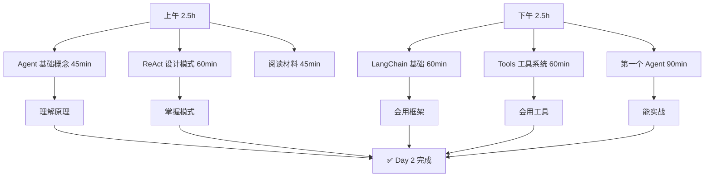
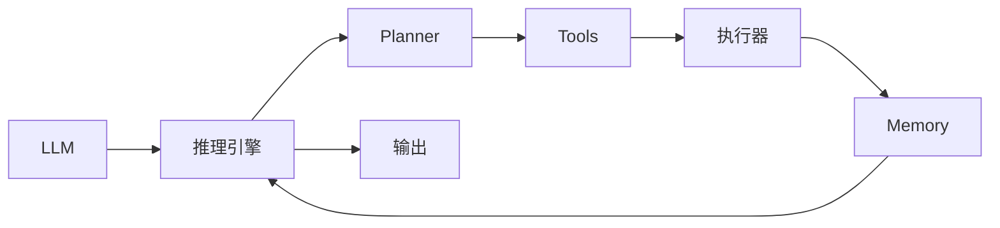
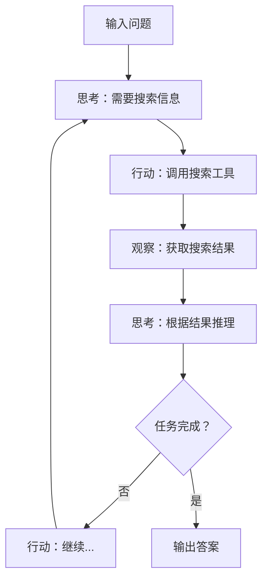

# Day 2 - Agent 核心概念与 LangChain 入门

**日期**: 2026-04-01（周二） → 2026-04-03（周四）  
**预计时间**: 5-6 小时  
**难度**: ⭐⭐⭐  
**状态**: ✅ 已完成

---

## 📚 学习目标

完成今天的学习后，你将能够：

- ✅ 解释什么是 AI Agent（能向别人讲清楚）
- ✅ 理解 ReAct 设计模式的工作原理
- ✅ 掌握 LangChain 核心组件
- ✅ 创建第一个能调用工具的 Agent
- ✅ 理解 Agent 的决策循环

---

## 🗺️ 今日学习路线图



---

## 📖 上午：理论基础（2.5 小时）

### 1. Agent 核心概念（45 分钟）

#### 1.1 什么是 AI Agent？

**定义**：AI Agent = LLM + 推理 + 行动 + 反馈循环

```
传统 LLM：
输入 → 输出（一次性）

AI Agent：
输入 → 推理 → 行动 → 观察 → 反馈 → ... → 输出（多轮循环）
```

#### 1.2 Agent vs 普通 LLM 调用

| 特性 | 普通 LLM | AI Agent |
|------|---------|----------|
| 响应方式 | 一次性 | 多轮循环 |
| 工具使用 | 无 | 有 |
| 记忆能力 | 无/有限 | 有（长期记忆） |
| 自主性 | 被动 | 主动 |
| 适用场景 | 简单问答 | 复杂任务 |

#### 1.3 Agent 核心组件



**四大组件**：
1. **LLM** - 大脑，理解和生成文本
2. **Memory** - 记忆，存储上下文
3. **Tools** - 工具，与外部世界交互
4. **Planning** - 规划，分解和执行任务

#### 1.4 Agent 的决策循环

```python
# Agent 决策循环伪代码
while not task_completed:
    1. 理解当前任务
    2. 决定下一步行动（思考）
    3. 执行行动（调用工具/生成回复）
    4. 观察结果（获取反馈）
    5. 评估是否完成
    6. 必要时调整计划
```

---

### 2. ReAct 设计模式（60 分钟）

#### 2.1 什么是 ReAct？

**ReAct = Reason + Act（推理 + 行动）**



**核心思想**：交替进行推理和行动，利用行动获取外部信息来辅助推理。

#### 2.2 ReAct vs 普通 Prompting

**普通 Prompting（Chain-of-Thought）**：
```
输入：问题是...)
输出：讓我思考一下...所以答案是X
（纯推理，不行动）
```

**ReAct**：
```
输入：问题是...
思考：需要知道X的最新信息
行动：搜索X
观察：搜索结果是...
思考：根据搜索结果...
行动：回答问题
输出：答案是...
```

#### 2.3 ReAct 的优势

| 优势 | 说明 |
|------|------|
| 获取实时信息 | 可以搜索互联网、查询数据库 |
| 执行实际操作 | 可以发送邮件、操作文件 |
| 减少幻觉 | 基于真实工具返回的信息 |
| 可解释性强 | 每一步都有记录 |

#### 2.4 ReAct 代码示例

```python
# 简化的 ReAct Agent（伪代码）
def react_agent(question, llm, tools):
    history = []
    
    while len(history) < max_steps:
        # 1. 构建 Prompt
        prompt = build_react_prompt(question, history, tools)
        
        # 2. LLM 生成
        response = llm.generate(prompt)
        
        # 3. 解析动作
        thought, action, action_input = parse_response(response)
        
        # 4. 记录思考
        history.append({
            "thought": thought,
            "action": action,
            "action_input": action_input
        })
        
        # 5. 执行动作
        if action == "Finish":
            return action_input
        
        if action in tools:
            observation = tools[action](action_input)
            history.append({"observation": observation})
        else:
            history.append({"observation": f"Unknown action: {action}"})
    
    return "达到最大步数，任务未完成"
```

#### 2.5 常见工具类型

```python
# 工具分类
tools = {
    # 搜索类
    "search": "搜索互联网",
    "wiki_search": "搜索维基百科",
    
    # 计算类
    "calculator": "数学计算",
    "python": "执行 Python 代码",
    
    # 文件类
    "read_file": "读取文件",
    "write_file": "写入文件",
    
    # API 类
    "send_email": "发送邮件",
    "api_call": "调用外部 API",
    
    # 工具类
    "memory": "存储/读取记忆"
}
```

---

### 3. 阅读材料（45 分钟）

#### 必读材料

1. **[ReAct 论文 - Google/DeepMind](https://arxiv.org/abs/2210.03629)** (25min)
   - 原始论文
   - 重点看：Method 和 Experiment 部分
   - 价值：理解 ReAct 的理论基础

2. **[LangChain Agents 官方文档](https://python.langchain.com/docs/modules/agents/)** (20min)
   - 官方教程
   - 重点看：Agent 类型 和 Tool 使用
   - 价值：代码实现参考

#### 选读材料

3. **[LLM Agent 架构详解 - Lil'Log](https://lilianweng.github.io/posts/2023-05-07-agentic-llm/)**
   - 作者是前 OpenAI 研究员
   - 必看：Agent Components 部分
   - 中文翻译搜一下就有了

---

## 💻 下午：代码实践（2.5 小时）

### 4. LangChain 基础（60 分钟）

#### 4.1 安装 LangChain

```bash
# 激活虚拟环境
cd ~/ai-agent-learning
source .venv/bin/activate

# 安装 LangChain 核心
pip install langchain>=0.3.0
pip install langchain-core

# 安装 LLM 提供商
pip install langchain-openai      # OpenAI
pip install langchain-anthropic  # Anthropic/Claude

# 安装工具
pip install langchain-community  # 社区工具

# 验证安装
python -c "import langchain; print(langchain.__version__)"
```

#### 4.2 核心概念详解

##### LLM 封装

```python
from langchain_openai import ChatOpenAI
from langchain.messages import HumanMessage

# 初始化 LLM
llm = ChatOpenAI(
    model="gpt-3.5-turbo",
    temperature=0.7,
    api_key="your-key"  # 或设置环境变量 OPENAI_API_KEY
)

# 同步调用
response = llm.invoke([HumanMessage(content="你好")])
print(response.content)

# 流式调用
for chunk in llm.stream([HumanMessage(content="讲个笑话")]):
    print(chunk.content, end="", flush=True)
```

##### Prompt Templates

```python
from langchain_core.prompts import PromptTemplate

# 定义模板
template = """你是一位{role}，专门帮助用户{task}。
用户的问题是：{question}

请用{style}风格回答。"""

prompt = PromptTemplate(
    template=template,
    input_variables=["role", "task", "question", "style"]
)

# 使用模板
formatted_prompt = prompt.format(
    role="旅行助手",
    task="规划行程",
    question="我想去日本东京一周，怎么安排？",
    style="专业但friendly"
)

response = llm.invoke(formatted_prompt)
print(response.content)
```

##### Chains（链）

```python
from langchain.chains import LLMChain

# 创建链
chain = LLMChain(
    llm=llm,
    prompt=prompt
)

# 执行链
result = chain.run(
    role="旅行助手",
    task="规划行程",
    question="我想去日本东京一周",
    style="专业"
)
print(result)
```

#### 4.3 LangChain 版本说明

| 版本 | 安装命令 | 特点 |
|------|---------|------|
| 0.1.x | `pip install langchain` | 新架构 |
| 0.2.x | `pip install langchain-core` | 拆分后核心 |
| 0.3.x | `pip install langchain>=0.3` | 最新稳定版 |

**注意**：如果是新项目，用 0.3.x。如果是老项目迁移，看官方迁移指南。

---

### 5. Tools 工具系统（60 分钟）

#### 5.1 内置工具使用

```python
from langchain_community.tools import DuckDuckGoSearchRun
from langchain.tools import Tool

# 方法 1：使用内置工具
search = DuckDuckGoSearchRun()
result = search.run("什么是 AI Agent")
print(result)

# 方法 2：创建自定义工具
def get_weather(city: str) -> str:
    """获取城市天气（模拟）"""
    weather_data = {
        "北京": "晴，15-25°C",
        "上海": "多云，18-28°C",
        "深圳": "雨，22-30°C"
    }
    return weather_data.get(city, "未知城市")

weather_tool = Tool(
    name="天气查询",
    func=get_weather,
    description="用于查询指定城市的天气情况"
)

# 使用工具
result = weather_tool.invoke("北京")
print(result)  # 输出：晴，15-25°C
```

#### 5.2 @tool 装饰器（推荐）

```python
from langchain.tools import tool

@tool
def calculate(expression: str) -> str:
    """执行数学计算"""
    try:
        # 注意：生产环境不要用 eval！
        result = eval(expression, {"__builtins__": {}}, {})
        return f"计算结果：{result}"
    except Exception as e:
        return f"计算错误：{str(e)}"

@tool
def get_current_time() -> str:
    """获取当前时间"""
    from datetime import datetime
    return datetime.now().strftime("%Y-%m-%d %H:%M:%S")

# 列出所有工具
tools = [calculate, get_current_time]
for t in tools:
    print(f"- {t.name}: {t.description}")
```

#### 5.3 绑定工具到 LLM

```python
from langchain_openai import ChatOpenAI
from langchain.agents import create_agent, AgentType

llm = ChatOpenAI(temperature=0)

# 初始化 Agent
agent = create_agent(
    tools=[calculate, get_current_time],
    llm=llm,
    agent=AgentType.ZERO_SHOT_REACT_DESCRIPTION,
    verbose=True
)

# 测试
result = agent.run("计算 123 * 456，然后告诉我现在几点")
print(result)
```

---

### 6. 第一个 Agent 实战（90 分钟）

#### 6.1 创建项目结构

```bash
cd ~/ai-agent-learning
mkdir -p day-02
cd day-02
touch agent_with_tools.py search_agent.py
```

#### 6.2 完整代码：搜索 Agent

创建文件 `search_agent.py`:

```python
#!/usr/bin/env python3
"""
Day 2: 第一个带工具的 Agent
功能：搜索 + 计算 + 天气查询
"""

import os
from langchain_openai import ChatOpenAI
from langchain.agents import create_agent, AgentType
from langchain.tools import Tool
from langchain_community.tools import DuckDuckGoSearchRun

# 设置 API Key（也可以用 .env 文件）
os.environ["OPENAI_API_KEY"] = os.getenv("OPENAI_API_KEY", "your-key-here")

# 1. 初始化 LLM
llm = ChatOpenAI(
    model="gpt-3.5-turbo",
    temperature=0.7,
    verbose=True
)

# 2. 定义工具
def get_weather(city: str) -> str:
    """查询城市天气（模拟数据）"""
    weather_db = {
        "北京": "晴，15-25°C，PM2.5 良",
        "上海": "多云，18-28°C，PM2.5 优",
        "深圳": "雷阵雨，22-30°C，PM2.5 良",
        "广州": "大雨，23-29°C，PM2.5 优",
    }
    return weather_db.get(city, f"未找到 {city} 的天气数据")

def calculate(expression: str) -> str:
    """执行数学计算"""
    try:
        result = eval(expression, {"__builtins__": {}}, {})
        return f"{expression} = {result}"
    except Exception as e:
        return f"计算错误: {e}"

def search_web(query: str) -> str:
    """搜索互联网"""
    search = DuckDuckGoSearchRun()
    return search.run(query)

# 3. 包装成 Tool
tools = [
    Tool(
        name="天气查询",
        func=get_weather,
        description="查询城市天气信息，输入是城市名"
    ),
    Tool(
        name="计算器",
        func=calculate,
        description="执行数学计算，输入是数学表达式"
    ),
    Tool(
        name="搜索",
        func=search_web,
        description="搜索互联网获取最新信息"
    )
]

# 4. 初始化 Agent
agent = create_agent(
    tools,
    llm,
    agent=AgentType.ZERO_SHOT_REACT_DESCRIPTION,
    verbose=True,
    max_iterations=5,
    max_execution_time=60
)

# 5. 测试用例
test_cases = [
    "北京今天天气怎么样？",
    "计算 123 + 456 - 789 = ?",
    "搜索什么是 AI Agent",
    "上海天气如何？明天去上海需要带伞吗？"
]

if __name__ == "__main__":
    print("=" * 50)
    print("Day 2: Agent with Tools")
    print("=" * 50)
    
    for i, test in enumerate(test_cases, 1):
        print(f"\n【测试 {i}】{test}")
        print("-" * 40)
        try:
            result = agent.run(test)
            print(f"结果: {result}")
        except Exception as e:
            print(f"错误: {e}")
        print("-" * 40)
```

#### 6.3 运行测试

```bash
# 运行
python search_agent.py

# 预期输出：
# 【测试 1】北京今天天气怎么样？
# > Entering new Agent chain...
# Thought: 需要查询北京的天气
# Action: 天气查询
# Action Input: 北京
# 观察: 晴，15-25°C，PM2.5 良
# Thought: 已获取天气信息，可以回答用户
# Finish: 北京今天天气晴，气温15-25°C，PM2.5 良好。
# > Finished chain.
```

#### 6.4 调试技巧

```python
# 启用详细日志
agent = create_agent(
    tools,
    llm,
    agent=AgentType.ZERO_SHOT_REACT_DESCRIPTION,
    verbose=True,          # 打印完整过程
    handle_parsing_errors=True  # 处理解析错误
)

# 自定义错误处理
def custom_error_handler(error):
    return f"出错了，请重试。错误信息：{error}"

agent = create_agent(
    tools,
    llm,
    agent=AgentType.ZERO_SHOT_REACT_DESCRIPTION,
    handle_parsing_errors=custom_error_handler
)
```

---

## ✅ 完成检查清单

### 理论部分
- [x] 理解 Agent 核心组件（LLM, Memory, Tools, Planning）
- [x] 掌握 ReAct 设计模式
- [x] 能区分 Agent 和普通 LLM 调用
- [x] 理解 Agent 决策循环

### 实践部分
- [x] LangChain 环境搭建完成
- [x] 会使用 Prompt Templates
- [x] 会创建自定义 Tools
- [x] 能初始化 Agent
- [x] Agent 能调用工具完成实际任务

### 代码提交
- [x] 搜索 Agent 代码完成
- [x] 测试通过
- [x] 提交到 Git

### 📌 组件学习进度

Day 2 完成了 **LLM** 和 **Tools** 的学习，另外两个组件在后续天数：

| 组件 | 状态 | 详细学习 |
|------|------|---------|
| LLM | ✅ 已学 | Day 2 - LangChain 基础 |
| Tools | ✅ 已学 | Day 2 - Tools 工具系统 |
| Memory | 📅 待学 | Day 3 - 记忆系统与 RAG 基础 |
| Planning | 📅 待学 | Day 8 - Agent 规划能力 |

---

## 📝 学习笔记模板

```markdown
## Day 2 学习心得

### 新知识
1. Agent vs LLM：Agent = LLM + 工具 + 决策循环
2. ReAct：Reason + Act，交替推理和行动
3. LangChain：LLM 应用开发框架

### 工具系统
- 搜索工具：获取实时信息
- 计算器：数学运算
- 天气查询：API 调用示例

### 踩坑记录
1. langchain 的 `OpenAI` 与 `ChatOpenAI` 接入端点不通。
 OpenAI 类（调用 /completions 端点），但 MiniMax chat 模型需要用 ChatOpenAI（调用 /chat/completions 端点）。

### 思考
Agent 的优势在于能主动调用工具减少幻觉，
但也增加了复杂度和调试难度。

### 明日改进
- ReAct 源论文需要再看一遍
- 阅读 LangChain 开发文档
```

---

## 🔗 资源汇总

### 官方文档
- [LangChain 官方文档](https://python.langchain.com/docs/get_started/introduction)
- [LangChain GitHub](https://github.com/langchain-ai/langchain)
- [LangChain Academy](https://academy.langchain.ai/)

### 工具库
- [DuckDuckGo Search](https://github.com/langchain-ai/langchain-community)
- [Wikipedia Search](https://python.langchain.com/docs/integrations/tools/wikipedia)

### 学习教程
- [LangChain Crash Course](https://www.youtube.com/watch?v=FiLPMGDgxRI)
- [Build an Agent with LangChain](https://www.youtube.com/watch?v=mBfS6cNnA5E)

### 进阶阅读
- [Agent Survey Paper](https://arxiv.org/abs/2309.07864) - Agent 综述论文
- [Tool Learning for LLMs](https://arxiv.org/abs/2305.16601) - 工具学习

---

## 💡 常见问题 FAQ

**Q1: Agent 输出总是调用同一个工具？**

A: 检查 Tool 的 description 是否足够清晰，Agent 可能误解了你的意图。

**Q2: Agent 进入死循环？**

A: 设置 `max_iterations` 和 `max_execution_time` 限制。

**Q3: 工具调用失败？**

A: 检查 Tool 的函数签名和返回值类型是否符合 LangChain 要求。

**Q4: 搜索工具返回结果太长？**

A: 使用 `Tool` 的 `description` 参数限制 Agent 理解，或截断结果。

**Q5: 不想用 OpenAI？**

A: 替换 `ChatOpenAI` 为 `ChatAnthropic`、`ChatCohere` 等。

---

## 🎯 练习题

### 基础题
1. 修改天气查询工具，添加更多城市
2. 添加一个"记住"工具，存储信息到文件

### 进阶题
3. 创建一个"日程管理"Agent，可以添加/查询/删除日程
4. 为 Agent 添加长期记忆（存储到文件）

### 挑战题
5. 创建多 Agent 协作系统（一个搜索，一个总结）

---

## 🚀 进阶阅读：其他 Agent 设计模式

> 📚 学习完 ReAct 之后，了解其他主流设计模式有助于在不同场景下选择合适的方案。

### 1. Plan-and-Execute（计划-执行）

**核心思想**：先规划所有步骤，再按顺序执行。适合复杂任务的分解和执行。

```
问题 → 规划步骤 → [步骤1] → [步骤2] → [步骤3] → 完成
```

**优点**：
- 任务分解清晰，可控性强
- 便于人工审核中间步骤
- 适合长周期复杂任务

**代码示例**：
```python
def plan_and_execute(task, llm, tools):
    # 1. 规划阶段
    plan = llm.generate(f"分解任务：{task}")
    
    # 2. 执行阶段
    results = []
    for step in plan.steps:
        result = execute_step(step, tools)
        results.append(result)
    
    # 3. 汇总结果
    return summarize(results)
```

**适用场景**：需要提前规划、数据处理流水线、报告生成

---

### 2. Self-Ask（自我追问）

**核心思想**：模型自己提出子问题，逐步分解，逐步回答。

```
Q: 主要问题是什么？
→ 子问题1：需要先知道什么？
→ 回答子问题1
→ 子问题2：...
→ ... → 最终答案
```

**优点**：
- 强制模型展开思考过程
- 自然分解复杂问题
- 可解释性强

**代码示例**：
```python
def self_ask_agent(question, llm):
    history = []
    current_q = question
    
    while not is_answered(current_q):
        # 模型自己提出子问题
        sub_q = llm.generate(f"这个问题：{current_q}，需要先回答什么？")
        answer = llm.generate(f"回答：{sub_q}")
        history.append({"q": sub_q, "a": answer})
        
        # 基于子问题答案更新理解
        current_q = llm.generate(f"基于 {history}，如何回答 {question}？")
    
    return current_q
```

**适用场景**：研究型问答、复杂逻辑推理、需要多角度分析的问题

---

### 3. Tree of Thoughts (ToT)（思维树）

**核心思想**：探索多条思维路径，树状结构，可回溯。

```
         问题
       /  |  \
    路径A 路径B  路径C
     |     |      |
    ...   ...    ...
     \     |     /
      \    |    /
       最优路径
```

**优点**：
- 探索多种解决方案
- 支持回溯和剪枝
- 适合需要搜索的问题

**适用场景**：战略规划、复杂问题求解、需要探索多种可能性的任务

---

### 4. Hierarchical Agents（层级 Agent）

**核心思想**：多个专门 Agent 由一个 Supervisor 协调。

```
        Supervisor Agent
       /      |      \
  Search   Calculator  Writer
  Agent     Agent     Agent
```

**优点**：
- 专业化分工
- 可并行执行独立任务
- 易于扩展

**代码示例**：
```python
# Supervisor 负责分配任务
def supervisor(task, llm, sub_agents):
    plan = llm.generate(f"分解任务 {task}，分配给子Agent")
    
    # 并行执行
    results = parallel_execute(plan.subtasks, sub_agents)
    
    # Supervisor 汇总
    return llm.generate(f"汇总结果：{results}")
```

**适用场景**：复杂多职能任务、需要并行处理、内容生成流水线

---

### 5. Reflexion（反思）

**核心思想**：执行后进行自我反思，决定是否重试。

```
执行 → 观察结果 → 反思：是否正确？
       ↓ 是                    ↓ 否
       完成 ←── 重试 ←───── 调整策略
```

**优点**：
- 自动纠错
- 持续改进
- 减少失败率

**代码示例**：
```python
def reflexion_agent(task, llm, tools, max_retries=3):
    for attempt in range(max_retries):
        result = execute_task(task, tools)
        
        # 反思结果
        reflection = llm.generate(f"评估结果 {result}，是否有问题？")
        
        if reflection.is_correct:
            return result
        
        # 调整策略
        task = reflection.adjust(task)
    
    return "达到最大重试次数"
```

**适用场景**：需要高可靠性的任务、自我改进系统、复杂调试场景

---

### 6. Module RAG（检索增强 Agent）

**核心思想**：决策时从知识库检索相关信息，增强推理能力。

```
用户问题 → 检索知识库 → 结合上下文 → LLM 推理 → 执行 → 响应
              ↑
         外部知识库
```

**优点**：
- 减少幻觉
- 基于真实信息回答
- 可更新知识库

**适用场景**：专业领域问答、需要最新信息的任务、客服系统

---

### 7. 模式对比总结

| 模式 | 核心特点 | 适用场景 | 复杂度 |
|------|---------|---------|-------|
| **ReAct** | 推理+行动交替 | 工具调用、动态决策 | ⭐⭐ |
| **Plan-and-Execute** | 先规划后执行 | 复杂流水线、长任务 | ⭐⭐ |
| **Self-Ask** | 自我追问分解 | 复杂推理、研究问答 | ⭐⭐ |
| **ToT** | 多路径探索 | 战略规划、搜索问题 | ⭐⭐⭐ |
| **Hierarchical** | 多Agent协作 | 复杂多职能任务 | ⭐⭐⭐ |
| **Reflexion** | 执行+反思 | 高可靠性任务 | ⭐⭐⭐ |
| **Module RAG** | 检索增强 | 知识密集型任务 | ⭐⭐ |

---

### 进阶阅读材料

1. **[Plan-and-Execute 论文](https://arxiv.org/abs/2305.04091)** - 计划与执行分离的Agent架构
2. **[Self-Ask 论文](https://arxiv.org/abs/2210.03629)** - 继 ReAct 之后的追问式方法
3. **[Tree of Thoughts 论文](https://arxiv.org/abs/2305.10601)** - 多路径思维探索
4. **[Reflexion 论文](https://arxiv.org/abs/2303.11366)** - 语言 Agent 的自我反思
5. **[LLM Agent 综述](https://arxiv.org/abs/2309.07864)** - 各种 Agent 模式总结

---

**最后更新**: 2026-04-03
**版本**: 2.0 (深入学习版) → ✅ 已完成