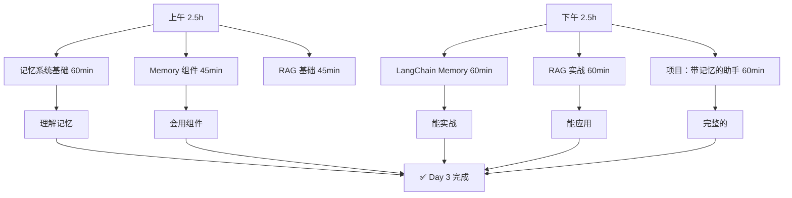
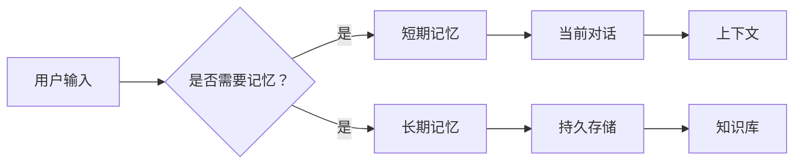
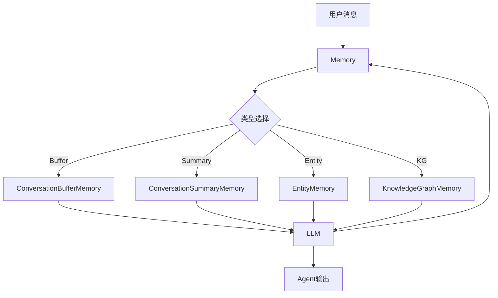
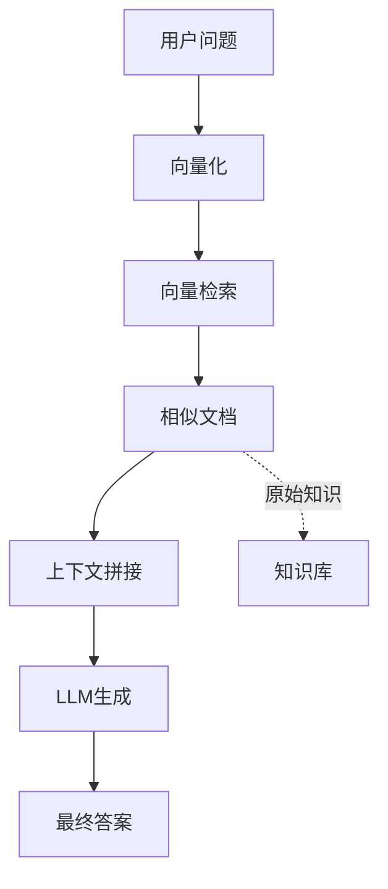

# Day 3 - 记忆系统与 RAG 基础

**日期**: 2026-04-03（周四）  
**预计时间**: 5-6 小时  
**难度**: ⭐⭐⭐  
**状态**: 📚 深入学习版 2.0

---

## 📚 学习目标

完成今天的学习后，你将能够：

- ✅ 解释 Agent 记忆系统的必要性和原理
- ✅ 区分短期记忆与长期记忆
- ✅ 掌握 ConversationBufferMemory 和 ConversationSummaryMemory
- ✅ 理解 RAG（检索增强生成）的工作流程
- ✅ 实现带记忆的对话助手
- ✅ 构建简单的 RAG 应用

---

## 🗺️ 今日学习路线图



---

## 📖 上午：理论基础（2.5 小时）

### 1. 记忆系统基础（60 分钟）

#### 1.1 为什么 Agent 需要记忆？

**问题**：没有记忆的 Agent 会怎样？

```
用户：我的名字是 GBoss
Agent：你好 GBoss！

用户：我叫什么？
Agent：...我不知道
```

**有记忆的 Agent**：
```
用户：我的名字是 GBoss
Agent：你好 GBoss！我记住了。

用户：我叫什么？
Agent：你叫 GBoss！
```

#### 1.2 记忆的类型



| 记忆类型 | 存储位置 | 生命周期 | 用途 |
|----------|----------|----------|------|
| **短期记忆** | 内存 | 当前对话 | 记住对话内容 |
| **长期记忆** | 文件/数据库 | 永久 | 跨会话记忆 |
| **工作记忆** | CPU | 即时 | 当前任务 |

#### 1.3 记忆的核心问题

| 问题 | 说明 | 解决方案 |
|------|------|----------|
| **上下文溢出** | 对话太长超出限制 | 摘要/截断 |
| **遗忘** | 新信息覆盖旧信息 | 重要信息提取 |
| **幻觉** | 记忆错误 | 验证机制 |
| **隐私** | 敏感信息泄露 | 脱敏/加密 |

---

### 2. LangChain Memory 组件（45 分钟）

#### 2.1 Memory 系统架构



#### 2.2 ConversationBufferMemory

```python
# 最基础的记忆：保存所有对话
from langchain.memory import ConversationBufferMemory

memory = ConversationBufferMemory(
    memory_key="chat_history",
    return_messages=True,
    output_key="answer",
    input_key="question"
)

# 增加对话
memory.chat_memory.add_user_message("你好")
memory.chat_memory.add_ai_message("你好！")

# 查看记忆
history = memory.load_memory_variables({})
print(history["chat_history"])
```

#### 2.3 ConversationSummaryMemory

```python
# 自动摘要：解决上下文过长问题
from langchain.memory import ConversationSummaryMemory
from langchain_openai import ChatOpenAI

llm = ChatOpenAI(temperature=0)

memory = ConversationSummaryMemory(
    llm=llm,
    memory_key="chat_history",
    return_messages=True
)

# 对话后会自动摘要
memory.save_context(
    {"question": "给我讲讲量子计算"},
    {"answer": "量子计算是一种利用量子力学原理..."}
)
```

#### 2.4 Entity Memory

```python
# 实体记忆：记住特定实体
from langchain.memory import EntityMemory

memory = EntityMemory(
    llm=llm,
    entity_name="用户"
)

# 记住实体信息
memory.save_context(
    {"input": "我叫 GBoss，是个程序员"},
    {"output": "好的 GBoss，程序员！"}
)

# 查询实体
result = memory.load_memory_variables({})
print(result["user"])
# 输出：程序员
```

---

### 3. RAG 基础（45 分钟）

#### 3.1 什么是 RAG？

**RAG = Retrieval-Augmented Generation（检索增强生成）**



**为什么需要 RAG？**：

1. **解决知识截止问题** - LLM 不知道最新信息
2. **减少幻觉** - 基于真实文档生成
3. **知识更新** - 无需重新训练模型
4. **可解释性** - 可以追溯来源

#### 3.2 RAG vs 普通 LLM

| 对比项 | 普通 LLM | RAG |
|----------|----------|------|
| 知识来源 | 训练数据 | 外部知识库 |
| 知识时效 | 固定 | 实时更新 |
| 幻觉 | 较多 | 较少 |
| 成本 | 固定 | 额外检索成本 |
| 引用 | 无 | 可追溯 |

#### 3.3 RAG 完整流程

```python
# RAG 流程代码
from langchain_community.vectorstores import Chroma
from langchain_openai import OpenAIEmbeddings
from langchain.text_splitter import CharacterTextSplitter
from langchain_core.documents import Document

# 1. 准备文档
documents = [
    Document(page_content="GPT 是 OpenAI 开发的语言模型", metadata={"source": "wiki"}),
    Document(page_content="Claude 是 Anthropic 开发的AI助手", metadata={"source": "wiki"}),
]

# 2. 文档分块
splitter = CharacterTextSplitter(chunk_size=100, chunk_overlap=0)
docs = splitter.split_documents(documents)

# 3. 向量存储
embeddings = OpenAIEmbeddings()
vectorstore = Chroma.from_documents(docs, embeddings)

# 4. 检索
retriever = vectorstore.as_retriever()
relevant_docs = retriever.get_relevant_documents("什么是 GPT?")

# 5. 生成
context = "\n".join([doc.page_content for doc in relevant_docs])
prompt = f"基于以下信息回答：{context}\n\n问题：什么是 GPT?"
response = llm.invoke(prompt)
```

---

## 💻 下午：代码实践（2.5 小时）

### 4. LangChain Memory 实战（60 分钟）

#### 4.1 带记忆的对话机器人

```python
#!/usr/bin/env python3
"""
Day 3: 带记忆的对话助手
功能：记住对话历史，支持多轮对话
"""

from langchain_openai import ChatOpenAI
from langchain.memory import ConversationBufferMemory
from langchain.chains import ConversationChain

# 初始化 LLM
llm = ChatOpenAI(temperature=0.7)

# 创建记忆
memory = ConversationBufferMemory(
    memory_key="chat_history",
    return_messages=True,
    output_key="response"
)

# 创建对话链
conversation = ConversationChain(
    llm=llm,
    memory=memory,
    verbose=True
)

# 多轮对话测试
print("=== 对话开始 ===")
print(conversation.predict(input="你好！我叫 GBoss"))
print("\n" + "="*30 + "\n")
print(conversation.predict(input="我叫什么是？"))
print("\n" + "="*30 + "\n")
print(conversation.predict(input="我刚才告诉你什么？"))
```

#### 4.2 带摘要的记忆

```python
#!/usr/bin/env python3
"""
带摘要记忆的对话：解决上下文过长问题
"""

from langchain.memory import ConversationSummaryMemory
from langchain_openai import ChatOpenAI

llm = ChatOpenAI(temperature=0)
memory = ConversationSummaryMemory(llm=llm)

# 模拟长对话
conversations = [
    ("你好，我是 GBoss", "你好 GBoss，很高兴认识你！"),
    ("我是一名安卓开发工程师", "哇，安卓开发！这是很有前景的领域。"),
    ("最近在学习 AI Agent", "AI Agent 是现在的热门方向！"),
    ("想转行做 Agent 开发", "很好的选择！Agent 开发需求很大。"),
    ("有什么建议吗？", "建议先学习 LangChain，然后多动手做项目。")
]

for user_input, expected in conversations:
    memory.save_context({"input": user_input}, {"output": expected})
    print(f"用户: {user_input}")
    print(f"AI: {expected}\n")

# 查看摘要后的记忆
summary = memory.load_memory_variables({})
print("=" * 30)
print("记忆摘要:")
print(summary["history"])
```

---

### 5. RAG 实战（60 分钟）

#### 5.1 简单 RAG 应用

```python
#!/usr/bin/env python3
"""
Day 3: 简单的 RAG 问答系统
"""

from langchain_community.vectorstores import Chroma
from langchain_openai import OpenAIEmbeddings, ChatOpenAI
from langchain.text_splitter import CharacterTextSplitter
from langchain_core.documents import Document

# 准备知识库
knowledge_base = """
GPT (Generative Pre-trained Transformer) 是 OpenAI 开发的大型语言模型。
第一代 GPT 于 2018 年发布，后续有 GPT-2、GPT-3、GPT-4 等版本。
ChatGPT 是基于 GPT 的对话产品，于 2022 年 11 月发布。

Claude 是 Anthropic 开发的大型语言模型，以安全和有帮助著称。
Claude 3 于 2024 年发布，包括 Claude 3 Opus、Haiku 和 Sonnet。

LangChain 是一个用于构建 LLM 应用的开发框架。
它提供了丰富的组件和工具，帮助开发者快速构建 AI 应用。
"""

# 1. 文档分块
splitter = CharacterTextSplitter(chunk_size=200, chunk_overlap=0)
docs = [Document(page_content=knowledge_base)]

# 2. 创建向量存储
texts = splitter.split_text(knowledge_base)
embeddings = OpenAIEmbeddings()
vectorstore = Chroma.from_texts(texts, embeddings, persist_directory="./chroma_db")

# 3. 创建检索器
retriever = vectorstore.as_retriever()

# 4. RAG 问答
def ask_with_rag(question):
    # 检索相关文档
    relevant_docs = retriever.get_relevant_documents(question)
    
    # 拼接上下文
    context = "\n".join([doc.page_content for doc in relevant_docs])
    
    # 生成回答
    prompt = f"""基于以下参考资料回答问题。
如果资料中没有相关信息，请如实告知。

参考资料：
{context}

问题：{question}

回答："""
    
    llm = ChatOpenAI(temperature=0)
    response = llm.invoke(prompt)
    return response.content, relevant_docs

# 测试
question = "GPT 是什么？"
answer, docs = ask_with_rag(question)
print(f"问题: {question}")
print(f"回答: {answer}")
print(f"参考文档数: {len(docs)}")
```

---

### 6. 项目：带记忆的 RAG 助手（60 分钟）

```python
#!/usr/bin/env python3
"""
Day 3 项目：个人知识助手
功能：可以记住用户的偏好，从个人知识库中检索回答
"""

from langchain_openai import ChatOpenAI
from langchain.memory import ConversationBufferMemory
from langchain_community.vectorstores import Chroma
from langchain_openai import OpenAIEmbeddings
from langchain_core.runnables import RunnablePassthrough

class PersonalAssistant:
    def __init__(self):
        self.llm = ChatOpenAI(temperature=0.7)
        self.memory = ConversationBufferMemory(
            memory_key="chat_history",
            return_messages=True
        )
        
        # 知识库（简化版，实际可以用向量数据库）
        self.knowledge = {
            "我的名字": "你叫 GBoss",
            "我的职业": "你是一名安卓开发工程师",
            "我的目标": "你想转行做 AI Agent 开发",
            "我喜欢": "目前不确定，但你在学习 AI Agent"
        }
    
    def chat(self, question):
        # 1. 搜索知识库
        context = ""
        for key, value in self.knowledge.items():
            if key in question or any(k in question for k in key.split()):
                context += f"- {key}: {value}\n"
        
        # 2. 构建 prompt
        prompt = f"""你是一个友好的 AI 助手。
用户的背景信息：
{context}

对话历史：
{self.memory.load_memory_variables().get('chat_history', '无')}

用户问题：{question}

请根据背景信息和对话历史回答。"""
        
        # 3. 获取回答
        response = self.llm.invoke(prompt)
        
        # 4. 保存到记忆
        self.memory.save_context(
            {"question": question},
            {"answer": response.content}
        )
        
        return response.content

# 使用
assistant = PersonalAssistant()

questions = [
    "你好！",
    "你认识我吗？",
    "我是做什么的？",
    "我的目标是什么？"
]

for q in questions:
    print(f"\n用户: {q}")
    print(f"助手: {assistant.chat(q)}")
```

---

## ✅ 完成检查清单

### 理论部分
- [ ] 理解为什么 Agent 需要记忆
- [ ] 区分短期记忆/长期记忆/工作记忆
- [ ] 掌握 ConversationBufferMemory 的使用
- [ ] 掌握 ConversationSummaryMemory 的使用
- [ ] 理解 RAG 的工作原理
- [ ] 理解 RAG vs 普通 LLM 的区别

### 实践部分
- [ ] 完成带记忆的对话机器人
- [ ] 完成 RAG 问答系统
- [ ] 运行项目代码成功
- [ ] 理解向量检索原理

### 代码提交
- [ ] 对话记忆代码
- [ ] RAG 项目代码
- [ ] 代码提交到 Git

---

## 📝 学习笔记模板

```markdown
## Day 3 学习心得

### 新知识
1. 记忆系统为什么必要？
2. Buffer Memory vs Summary Memory
3. RAG 检索增强生成

### RAG 理解
- 解决的问题：知识截止、幻觉
- 工作流程：向量化→检索→拼接→生成

### 项目难点
- 向量数据库选择
- 文档分块策略

### 明日改进
- 
```

---

## 🔗 资源链接

### 官方文档
- [LangChain Memory](https://python.langchain.com/docs/modules/memory/)
- [LangChain RAG](https://python.langchain.com/docs/modules/data_connection/)
- [Chroma 向量数据库](https://docs.trychroma.com/)

### 学习教程
- [RAG 最佳实践](https://blog.langchain.dev/rag-101/)
- [Memory 系统详解](https://www.youtube.com/watch?v=xxx)

### 进阶阅读
- [RAG 论文](https://arxiv.org/abs/2205.00445) - Facebook RAG 原始论文
- [Memory of Language Models](https://arxiv.org/abs/2310.13308) - 记忆机制研究

---

## 💡 常见问题 FAQ

**Q1: 记忆太多导致上下文溢出？**

A: 使用 ConversationSummaryMemory 自动摘要，或设置最大 token 数。

**Q2: 向量检索结果不相关？**

A: 调整 chunk_size 或尝试不同的 embedding 模型。

**Q3: RAG 成本太高？**

A: 使用免费的开源 embedding 模型（如 MiniChat）。

**Q4: 如何选择向量数据库？**

A:
- 简单/实验：Chroma（本地）
- 生产：Pinecone/Weaviate
- 成本优先：Qdrant

---

## 🎯 练习题

### 基础题
1. 修改对话代码，支持保存和加载记忆
2. 给知识库添加更多信息

### 进阶题
3. 实现文件知识库导入（RAG）
4. 给记忆添加时间戳

### 挑战题
5. 实现多知识库切换（个人/工作/公开）

---

**最后更新**: 2026-04-03  
**版本**: 2.0 (深入学习版)